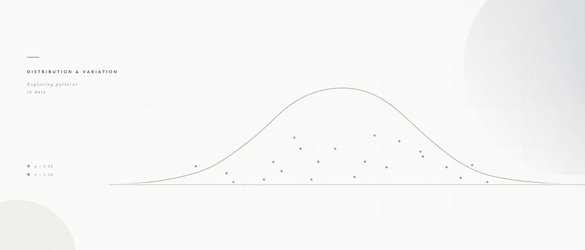

# Learning Outcome

This hands-on exercise focuses on learning how to construct statistical graphics using the Layered Grammar of Graphics in ggplot2. The exercise uses the Exam_data dataset to demonstrate how different graphical layers, aesthetic mappings, geometric objects, statistical transformations, faceting, coordinates, and themes can be combined to produce clear and meaningful visualisations.

The main objective is not only to reproduce the charts from the tutorial, but also to understand how each ggplot2 component contributes to the final visual output.

# Getting started

### Installing and launching R packages

Before creating any visualisation, the required R packages need to be loaded. In this exercise, the `pacman` package is used because it can check whether the required packages are installed and load them into the R session automatically.

The main package used here is `tidyverse`, which includes `ggplot2` for data visualisation and other useful tools for data handling.

```{r}
pacman::p_load(tidyverse)

vaa_palette <- c("#2A6F6F", "#D95F02", "#F2A65A", "#7570B3")

race_palette <- c(
  "Malay" = "#2A6F6F",
  "Chinese" = "#D95F02",
  "Indian" = "#F2A65A",
  "Others" = "#7570B3"
)

gender_palette <- c(
  "Male" = "#2A6F6F",
  "Female" = "#D95F02"
)

vaa_chart_theme <- theme_minimal(base_size = 12) +
  theme(
    plot.title = element_text(face = "bold"),
    plot.subtitle = element_text(size = 10),
    axis.title = element_text(face = "bold"),
    panel.grid.minor = element_blank()
  )
```

## Importing the data

```{r}
exam_data <- read_csv("Exam_data.csv")
```

### Previewing the data

Before creating the visualisations, the dataset is briefly checked to understand its structure, variables, and data types. This helps to decide which variables are suitable for categorical plots and which variables are suitable for numerical plots.

```{r}
glimpse(exam_data)
```

## Introducing ggplot2: Distribution of Students by Race

ggplot2 is an R package for **declaratively** creating **data-driven** graphics based on ***The Grammar of Graphics.***

It is also part of the tidyverse family specially designed for visual exploration and communication.

For more detail, visit [ggplot2 link](https://ggplot2.tidyverse.org/).o(\^\_-)O

### Basic Bar Chart Using `geom_bar()`

The first visualisation is a simple bar chart showing the distribution of students by race. Since `RACE` is a categorical variable, `geom_bar()` is suitable because it counts the number of observations in each category automatically.

```{r}
ggplot(data = exam_data,
       aes(x = RACE)) + 
  geom_bar(
    fill = "#2A6F6F",
    color = "#1F1F1F",
    linewidth = 0.35,
    width = 0.65
  ) +
  labs(
    title = "Distribution of Students by Race",
    x = "Race",
    y = "Number of Students"
  ) +
  vaa_chart_theme
```

### Improving the Bar Chart Design

The basic bar chart correctly shows the distribution of students by race, but the default ggplot2 style can be improved. The following version adds a clearer title, axis labels, a cleaner theme, and a more intentional colour design.

```{r}
ggplot(data = exam_data,
       aes(x = RACE, fill = RACE)) +
  geom_bar(color = "#1F1F1F", linewidth = 0.35, width = 0.65) +
  scale_fill_manual(values = race_palette) +
  labs(
    title = "Distribution of Students by Race",
    subtitle = "Based on the Exam_data dataset",
    x = "Race",
    y = "Number of Students"
  ) +
  vaa_chart_theme +
  theme(
    legend.position = "none",
    plot.title = element_text(face = "bold", size = 14),
    plot.subtitle = element_text(size = 10),
    axis.title = element_text(face = "bold")
  )
```

From the improved bar chart, Chinese students form the largest group in the dataset, followed by Malay students. Indian students and students classified under Others make up much smaller groups. This indicates that the dataset is not evenly distributed across race categories, which should be considered when interpreting later comparisons by race.

### Aesthetic Mapping versus Fixed Aesthetic

In ggplot2, aesthetics can be controlled in two different ways. If an aesthetic such as `fill` is placed inside `aes()`, it is mapped to a variable in the dataset. If it is placed outside `aes()`, it is applied as a fixed visual setting.

```{r}
ggplot(data = exam_data,
       aes(x = RACE)) +
  geom_bar(
    fill = "#2A6F6F",
    color = "#1F1F1F",
    linewidth = 0.35,
    width = 0.65
  ) +
  labs(
    title = "Distribution of Students by Race with Fixed Fill Colour",
    x = "Race",
    y = "Number of Students"
  ) +
  vaa_chart_theme
```

Unlike the previous improved bar chart, this version uses a fixed fill colour. The colour is not linked to the `RACE` variable, so all bars share the same colour. This is useful when the purpose is to compare bar heights without using colour to represent categories.

### Comparing `geom_bar()` and `geom_col()`

`geom_bar()` is used when the dataset contains raw observations and ggplot2 needs to count the number of rows in each category. In contrast, `geom_col()` is used when the dataset already contains summarised values.

```{r}
race_count <- exam_data %>%
  count(RACE)

race_count
```

The summarised table can now be visualised using `geom_col()`. Unlike `geom_bar()`, `geom_col()` does not count rows automatically. Instead, it uses the pre-calculated `n` column as the height of each bar.

```{r}
ggplot(data = race_count,
       aes(x = RACE, y = n)) +
  geom_col(fill = "#2A6F6F", color = "#1F1F1F", linewidth = 0.35, width = 0.65) +
  labs(
    title = "Race Distribution Using Summarised Data",
    subtitle = "Using geom_col() with pre-counted values",
    x = "Race",
    y = "Number of Students"
  ) +
  vaa_chart_theme +
  theme(
    plot.title = element_text(face = "bold", size = 14),
    plot.subtitle = element_text(size = 10),
    axis.title = element_text(face = "bold")
  )
```

This bar chart is created using `geom_col()`, which is suitable when the dataset has already been summarised. In this case, the table `race_count` contains the pre-calculated number of students in each race category, and the column `n` is mapped to the y-axis. Unlike `geom_bar()`, `geom_col()` does not perform automatic counting.

## Visualising the Distribution of English Scores

After examining the distribution of a categorical variable, the next step is to explore a numerical variable. In this section, the English scores are visualised to understand the overall score distribution, including the spread, concentration, and possible unusual values.

### Dot Plot of English Scores

A dot plot gives a compact view of how individual English scores are distributed. Each dot represents observations around a score value, making it useful for seeing where the scores are clustered.

```{r}
ggplot(data = exam_data,
       aes(x = ENGLISH)) +
  geom_dotplot(
    binwidth = 2.5,
    dotsize = 0.6,
    fill = "#2A6F6F",
    color = "#1F1F1F"
  ) +
  labs(
    title = "Dot Plot of English Scores",
    subtitle = "Each dot represents students grouped by similar score values",
    x = "English Score",
    y = "Density"
  ) +
  vaa_chart_theme +
  theme(
    plot.title = element_text(face = "bold", size = 14),
    plot.subtitle = element_text(size = 10),
    axis.title = element_text(face = "bold")
  )
```

### Histogram of English Scores

The histogram shows the overall distribution of English scores more clearly than the dot plot. Most students are concentrated in the middle score ranges, while very low and very high scores appear less frequently.

```{r}
ggplot(data = exam_data,
       aes(x = ENGLISH)) +
  geom_histogram(
    binwidth = 5,
    boundary = 0,
    fill = "#5B7F6E",
    color = "#1F1F1F",
    linewidth = 0.35
  ) +
  labs(
    title = "Histogram of English Scores",
    subtitle = "Distribution of English scores in 5-point intervals",
    x = "English Score",
    y = "Number of Students"
  ) +
  vaa_chart_theme +
  theme(
    plot.title = element_text(face = "bold", size = 14),
    plot.subtitle = element_text(size = 10),
    axis.title = element_text(face = "bold")
  )
```

English scores cluster mainly between 60 and 80, with the strongest concentration around the 70s. The thinner bars at both ends suggest that very low and near-perfect scores are relatively uncommon.

### Modifying `geom_histogram()`

The appearance of a histogram can be adjusted by changing the arguments inside `geom_histogram()`. Here, the bin width is made wider so that the score distribution is grouped into broader intervals.

```{r}
ggplot(data = exam_data,
       aes(x = ENGLISH)) +
  geom_histogram(
    binwidth = 10,
    boundary = 0,
    fill = "#D95F02",
    color = "#1F1F1F",
    linewidth = 0.35
  ) +
  labs(
    title = "English Score Distribution with Wider Bins",
    subtitle = "Using 10-point intervals",
    x = "English Score",
    y = "Number of Students"
  ) +
  vaa_chart_theme +
  theme(
    plot.title = element_text(face = "bold", size = 14),
    plot.subtitle = element_text(size = 10),
    axis.title = element_text(face = "bold")
  )
```

With wider bins, the histogram looks less detailed but shows the overall shape of the score distribution more clearly.

### Modifying Aesthetic Mapping

Aesthetic mapping changes how variables are connected to visual features. In this histogram, `GENDER` is mapped to `fill`, so the bars show how English score distributions differ between male and female students.

```{r}
ggplot(data = exam_data,
       aes(x = ENGLISH, fill = GENDER)) +
  geom_histogram(
    binwidth = 5,
    boundary = 0,
    color = "#1F1F1F",
    linewidth = 0.3,
    alpha = 0.75
  ) +
  scale_fill_manual(values = gender_palette) +
  labs(
    title = "English Score Distribution by Gender",
    subtitle = "Using fill mapping inside aes()",
    x = "English Score",
    y = "Number of Students",
    fill = "Gender"
  ) +
  vaa_chart_theme +
  theme(
    plot.title = element_text(face = "bold", size = 14),
    plot.subtitle = element_text(size = 10),
    axis.title = element_text(face = "bold"),
    legend.position = "top"
  )
```

Mapping \`GENDER\` to \`fill\` adds a second layer of information to the histogram. The bars are now coloured by gender, making it easier to see how male and female students contribute to the overall English score distribution.

### Density Plot of English Scores

A density plot provides a smoother view of the score distribution. It is useful when the goal is to see the general shape of the data without focusing on individual histogram bins.

```{r}
ggplot(data = exam_data,
       aes(x = ENGLISH)) +
  geom_density(
    fill = "#2A6F6F",
    color = "#1F1F1F",
    linewidth = 0.35,
    alpha = 0.65
  ) +
  labs(
    title = "Density Plot of English Scores",
    subtitle = "A smoother view of the score distribution",
    x = "English Score",
    y = "Density"
  ) +
  vaa_chart_theme +
  theme(
    plot.title = element_text(face = "bold", size = 14),
    plot.subtitle = element_text(size = 10),
    axis.title = element_text(face = "bold")
  )
```

The curve peaks around the higher-middle score range, which is consistent with the histogram pattern. Compared with the histogram, the density plot gives a cleaner view of the overall shape.

### Boxplot of English Scores by Gender

A boxplot is useful for comparing the distribution of a numerical variable across groups. Here, English scores are compared between male and female students.

```{r}
ggplot(data = exam_data,
       aes(x = GENDER, y = ENGLISH, fill = GENDER)) +
  geom_boxplot(
    color = "#1F1F1F",
    linewidth = 0.35,
    alpha = 0.8,
    outlier.color = "#D95F02",
    outlier.size = 2
  ) +
  scale_fill_manual(values = gender_palette) +
  labs(
    title = "English Scores by Gender",
    subtitle = "Comparing median, spread, and possible outliers",
    x = "Gender",
    y = "English Score",
    fill = "Gender"
  ) +
  vaa_chart_theme +
  theme(
    legend.position = "none",
    plot.title = element_text(face = "bold", size = 14),
    plot.subtitle = element_text(size = 10),
    axis.title = element_text(face = "bold")
  )
```

The boxplot makes the gender comparison more compact than the histogram. It highlights the median score, the spread of scores, and any possible outliers in each group.

### Violin Plot of English Scores by Gender

Boxplots are compact, but they can feel a little too compressed. A violin plot opens up the shape of the distribution, making it easier to see where scores are packed more tightly.

```{r}
ggplot(data = exam_data,
       aes(x = GENDER, y = ENGLISH, fill = GENDER)) +
  geom_violin(
    color = "#1F1F1F",
    linewidth = 0.35,
    alpha = 0.75,
    trim = FALSE
  ) +
  geom_boxplot(
    width = 0.12,
    color = "#1F1F1F",
    fill = "white",
    alpha = 0.7,
    outlier.color = "#D95F02",
    outlier.size = 1.8
  ) +
  scale_fill_manual(values = gender_palette) +
  labs(
    title = "English Score Shape by Gender",
    subtitle = "Violin plot with a compact boxplot overlay",
    x = "Gender",
    y = "English Score",
    fill = "Gender"
  ) +
  vaa_chart_theme +
  theme(
    legend.position = "none",
    plot.title = element_text(face = "bold", size = 14),
    plot.subtitle = element_text(size = 10),
    axis.title = element_text(face = "bold")
  )
```

The violin shape makes the score pattern less flat than a boxplot. The wider sections mark where more students are clustered, while the narrow tails show thinner score ranges.

### Scatter Plot of Maths and English Scores

A scatter plot is useful when the question shifts from “how one variable is distributed” to “how two variables move together”. Here, each point represents one student, with Maths score on the x-axis and English score on the y-axis.

```{r}
ggplot(data = exam_data,
       aes(x = MATHS, y = ENGLISH)) +
  geom_point(
    color = "#2A6F6F",
    alpha = 0.65,
    size = 2
  ) +
  labs(
    title = "Relationship Between Maths and English Scores",
    subtitle = "Each point represents one student",
    x = "Maths Score",
    y = "English Score"
  ) +
  vaa_chart_theme +
  theme(
    plot.title = element_text(face = "bold", size = 14),
    plot.subtitle = element_text(size = 10),
    axis.title = element_text(face = "bold")
  )
```

The point cloud leans clearly upward: stronger Maths scores usually come with stronger English scores. There are a few scattered exceptions, but the overall relationship is hard to miss.

### Adding a Trend Line to the Scatter Plot

The scatter plot already hints at a positive relationship. Adding a smooth trend line makes that pattern easier to read, especially when there are many points on the chart.

```{r}
ggplot(data = exam_data,
       aes(x = MATHS, y = ENGLISH)) +
  geom_point(
    color = "#2A6F6F",
    alpha = 0.55,
    size = 2
  ) +
  geom_smooth(
    method = "lm",
    se = TRUE,
    color = "#D95F02",
    fill = "#F2A65A",
    linewidth = 0.8
  ) +
  labs(
    title = "Maths and English Scores with Trend Line",
    subtitle = "Linear trend added using geom_smooth()",
    x = "Maths Score",
    y = "English Score"
  ) +
  vaa_chart_theme +
  theme(
    plot.title = element_text(face = "bold", size = 14),
    plot.subtitle = element_text(size = 10),
    axis.title = element_text(face = "bold")
  )
```

The fitted line cuts cleanly through the point cloud, reinforcing the positive relationship between Maths and English scores. The shaded band gives a quick sense of uncertainty around the trend.

## Working with Statistical Summaries

So far, the charts have mostly shown raw observations. Statistical summaries go one level higher: instead of plotting every individual value, they calculate a summary value first, then display it.

### Mean English Score by Gender

```{r}
ggplot(data = exam_data,
       aes(x = GENDER, y = ENGLISH, fill = GENDER)) +
  stat_summary(
    fun = mean,
    geom = "bar",
    color = "#1F1F1F",
    linewidth = 0.35,
    alpha = 0.8,
    width = 0.6
  ) +
  scale_fill_manual(values = gender_palette) +
  labs(
    title = "Mean English Score by Gender",
    subtitle = "Using stat_summary() to calculate group means",
    x = "Gender",
    y = "Mean English Score",
    fill = "Gender"
  ) +
  vaa_chart_theme +
  theme(
    legend.position = "none",
    plot.title = element_text(face = "bold", size = 14),
    plot.subtitle = element_text(size = 10),
    axis.title = element_text(face = "bold")
  )
```

Instead of showing every English score, this chart compresses each gender group into one mean value. It is cleaner, but also more ruthless: the spread and outliers disappear, so the chart should be read together with the earlier boxplot.

### Mean English Score with Error Bars

A mean bar alone looks clean, but it hides too much. Error bars add a quick check on how stable the mean comparison is.

```{r}
ggplot(data = exam_data,
       aes(x = GENDER, y = ENGLISH, fill = GENDER)) +
  stat_summary(
    fun = mean,
    geom = "bar",
    color = "#1F1F1F",
    linewidth = 0.35,
    alpha = 0.8,
    width = 0.6
  ) +
  stat_summary(
    fun.data = mean_se,
    geom = "errorbar",
    width = 0.18,
    color = "#1F1F1F",
    linewidth = 0.45
  ) +
  scale_fill_manual(values = gender_palette) +
  labs(
    title = "Mean English Score by Gender with Error Bars",
    subtitle = "Bars show means; error bars show standard error",
    x = "Gender",
    y = "Mean English Score",
    fill = "Gender"
  ) +
  vaa_chart_theme +
  theme(
    legend.position = "none",
    plot.title = element_text(face = "bold", size = 14),
    plot.subtitle = element_text(size = 10),
    axis.title = element_text(face = "bold")
  )
```

The bars still show the average English score for each gender, but the error bars stop the chart from pretending the averages are perfectly fixed. It is a small addition, but it makes the comparison more honest.

## Faceting

Faceting splits one chart into smaller panels. Instead of squeezing every group into one plot, it gives each group its own little stage.

### English Score Distribution by Class

```{r}
ggplot(data = exam_data,
       aes(x = ENGLISH)) +
  geom_histogram(
    binwidth = 5,
    boundary = 0,
    fill = "#2A6F6F",
    color = "#1F1F1F",
    linewidth = 0.3
  ) +
  facet_wrap(~ CLASS) +
  labs(
    title = "English Score Distribution by Class",
    subtitle = "Each panel shows one class",
    x = "English Score",
    y = "Number of Students"
  ) +
  vaa_chart_theme +
  theme(
    plot.title = element_text(face = "bold", size = 14),
    plot.subtitle = element_text(size = 10),
    axis.title = element_text(face = "bold"),
    strip.text = element_text(face = "bold")
  )
```

Faceting makes class-level patterns easier to scan. Instead of mixing all students into one histogram, each class gets its own panel, so differences in spread and concentration are easier to spot.

### Faceting by Gender and Race

`facet_grid()` arranges panels like a grid. This is useful when two categorical variables are involved and the comparison needs a cleaner structure.

```{r}
ggplot(data = exam_data,
       aes(x = ENGLISH)) +
  geom_histogram(
    binwidth = 5,
    boundary = 0,
    fill = "#D95F02",
    color = "#1F1F1F",
    linewidth = 0.3
  ) +
  facet_grid(GENDER ~ RACE) +
  labs(
    title = "English Score Distribution by Gender and Race",
    subtitle = "Rows show gender; columns show race",
    x = "English Score",
    y = "Number of Students"
  ) +
  vaa_chart_theme +
  theme(
    plot.title = element_text(face = "bold", size = 14),
    plot.subtitle = element_text(size = 10),
    axis.title = element_text(face = "bold"),
    strip.text = element_text(face = "bold")
  )
```

The grid layout is stricter than `facet_wrap()`: gender runs down the rows, while race runs across the columns. Some panels are sparse, which is a useful reminder that subgroup comparisons can get fragile when the sample size becomes small.

## Coordinates

Coordinate settings change how a plot is displayed without changing the underlying data. A simple example is flipping the x-axis and y-axis to make a bar chart easier to read.

### Flipping the Bar Chart

```{r}
ggplot(data = race_count,
       aes(x = RACE, y = n)) +
  geom_col(
    fill = "#2A6F6F",
    color = "#1F1F1F",
    linewidth = 0.35,
    width = 0.65
  ) +
  coord_flip() +
  labs(
    title = "Race Distribution with Flipped Coordinates",
    subtitle = "Same data, different reading direction",
    x = "Race",
    y = "Number of Students"
  ) +
  vaa_chart_theme +
  theme(
    plot.title = element_text(face = "bold", size = 14),
    plot.subtitle = element_text(size = 10),
    axis.title = element_text(face = "bold")
  )
```

Flipping the chart does not change the counts. It simply turns the bars sideways, which makes category labels easier to read and gives the chart a cleaner rhythm.

### Zooming into the Score Range

Sometimes the full axis range is not the most useful view. Here, the plot is zoomed into the main score range so the dense middle section is easier to inspect.

```{r}
ggplot(data = exam_data,
       aes(x = MATHS, y = ENGLISH)) +
  geom_point(
    color = "#2A6F6F",
    alpha = 0.6,
    size = 2
  ) +
  coord_cartesian(
    xlim = c(40, 100),
    ylim = c(40, 100)
  ) +
  labs(
    title = "Zoomed View of Maths and English Scores",
    subtitle = "Using coord_cartesian() to focus on the main score range",
    x = "Maths Score",
    y = "English Score"
  ) +
  vaa_chart_theme +
  theme(
    plot.title = element_text(face = "bold", size = 14),
    plot.subtitle = element_text(size = 10),
    axis.title = element_text(face = "bold")
  )
```

This zoomed view keeps the original data intact but focuses the display on the main score band. It is cleaner for reading the dense area, without pretending the lower scores never existed.

## Working with Themes

Themes control the non-data parts of a chart: background, grid lines, title style, axis text, legend position, and spacing. A good theme should not fight for attention; it should make the data easier to read.

### Applying a Custom Theme

```{r}
ggplot(data = exam_data,
       aes(x = MATHS, y = ENGLISH)) +
  geom_point(
    color = "#2A6F6F",
    alpha = 0.6,
    size = 2
  ) +
  geom_smooth(
    method = "lm",
    se = TRUE,
    color = "#D95F02",
    fill = "#F2A65A",
    linewidth = 0.8
  ) +
  labs(
    title = "Maths and English Scores with a Custom Theme",
    subtitle = "Theme settings improve readability without changing the data",
    x = "Maths Score",
    y = "English Score"
  ) +
  vaa_chart_theme +
  theme(
    plot.title = element_text(face = "bold", size = 15),
    plot.subtitle = element_text(size = 10, color = "grey30"),
    axis.title = element_text(face = "bold"),
    panel.grid.minor = element_blank(),
    panel.grid.major = element_line(linewidth = 0.25, color = "grey85")
  )
```

The theme changes do not alter the data or the statistical relationship. They simply clean up the visual surface: less noise, clearer text, and a chart that feels more intentional.

## Summary

This exercise shows how ggplot2 builds charts layer by layer. The same dataset can be explored from different angles: categorical distributions with bar charts, score distributions with dot plots, histograms and density plots, group comparisons with boxplots and violin plots, and score relationships with scatter plots.

The main takeaway is that ggplot2 is not just about drawing charts. It is about deciding what each layer does: what data to use, what variables to map, what geometric object to choose, what statistical summary to calculate, how to split panels with facets, how to adjust coordinates, and how to refine the final look with themes.


