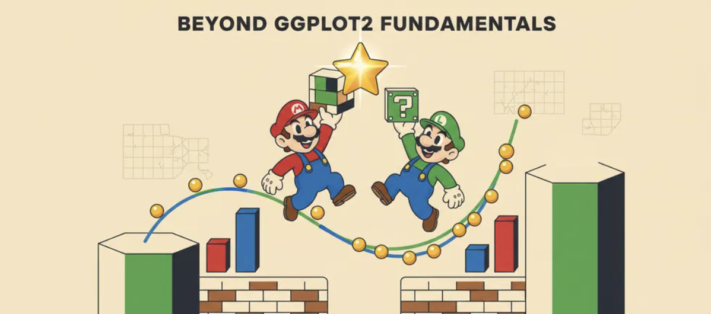

## Overview

This hands-on exercise moves beyond the basic ggplot2 grammar and focuses on making charts more polished, readable, and publication-ready. The main idea is simple: the chart should not only be technically correct, but also visually sharp enough to communicate clearly.

For this exercise, the visual style will follow a Mario-inspired colour system: saturated blue, red, yellow, green, cream, and black. The aim is not to make the charts look childish, but to use a bold and consistent palette across the whole page.

## Getting Started

### Loading R packages

```{r}
pacman::p_load(tidyverse, ggthemes, hrbrthemes, patchwork, ggrepel)
```

### Importing the data

The same exam dataset is used again, but this time the charts will get a stronger visual identity. Think Mario palette: blue skies, red caps, yellow coins, green pipes — loud colours, but controlled properly.

```{r}
exam_data <- read_csv("Exam_data.csv")

glimpse(exam_data)
```

### Mario-inspired colour palette

```{r}
mario_blue <- "#1E5AA8"
mario_red <- "#D62828"
mario_yellow <- "#F7C531"
mario_green <- "#2E8B57"
mario_black <- "#1F1F1F"
mario_cream <- "#FFF3D6"
mario_sky <- "#6EC6FF"
```

## Polishing a Basic Bar Chart

A plain bar chart can do the job, but it usually looks unfinished. Here, the same race distribution chart is rebuilt with stronger colours, cleaner spacing, and a sharper visual style.

```{r}
ggplot(data = exam_data,
       aes(x = RACE, fill = RACE)) +
  geom_bar(
    width = 0.65,
    color = mario_black,
    linewidth = 0.35
  ) +
  scale_fill_manual(
    values = c(
      "Chinese" = mario_red,
      "Indian" = mario_green,
      "Malay" = mario_blue,
      "Others" = mario_yellow
    )
  ) +
  labs(
    title = "Student Distribution by Race",
    subtitle = "A cleaner version of the basic bar chart",
    x = "Race",
    y = "Number of Students"
  ) +
  ggthemes::theme_fivethirtyeight() +
  theme(
    legend.position = "none",
    plot.title = element_text(face = "bold", size = 16, color = mario_black),
    plot.subtitle = element_text(size = 11, color = "grey30"),
    axis.title = element_text(face = "bold", size = 10),
    axis.text = element_text(color = mario_black)
  )
```

The chart keeps the same basic message as Exercise 1, but the visual tone is stronger. The black outlines keep the saturated colours under control, so the page feels bold rather than messy.

## Adding Smart Labels with ggrepel

Labels can make a chart easier to read, but only if they do not crash into each other. Here, each point represents one class, and `ggrepel` helps place the class labels neatly around the points.

```{r}
subject_average <- exam_data %>%
  group_by(CLASS) %>%
  summarise(
    avg_maths = mean(MATHS),
    avg_english = mean(ENGLISH),
    .groups = "drop"
  )

ggplot(data = subject_average,
       aes(x = avg_maths, y = avg_english, label = CLASS)) +
  geom_point(
    size = 4,
    color = mario_red,
    alpha = 0.85
  ) +
  geom_label_repel(
    fill = mario_yellow,
    color = mario_black,
    fontface = "bold",
    box.padding = 0.35,
    point.padding = 0.25,
    segment.color = mario_black,
    segment.linewidth = 0.3
  ) +
  labs(
    title = "Class Average Scores: Maths vs English",
    subtitle = "Class labels are placed neatly with ggrepel",
    x = "Average Maths Score",
    y = "Average English Score"
  ) +
  theme_minimal(base_size = 12) +
  theme(
    plot.title = element_text(face = "bold", size = 16, color = mario_black),
    plot.subtitle = element_text(size = 11, color = "grey30"),
    axis.title = element_text(face = "bold"),
    panel.grid.minor = element_blank()
  )
```

Each dot is one class. The yellow labels are pushed away from the dots, so the chart stays readable instead of turning into a label pile-up. \## Applying a Cleaner Theme with hrbrthemes

Default ggplot charts can feel a bit classroom-ish. `hrbrthemes` gives the chart more breathing room: lighter grid lines, cleaner typography, and a calmer layout. The Mario colours stay loud, but the theme keeps them disciplined.

```{r}
ggplot(data = exam_data,
       aes(x = ENGLISH)) +
  geom_histogram(
    binwidth = 5,
    boundary = 0,
    fill = mario_blue,
    color = mario_yellow,
    linewidth = 0.45
  ) +
  labs(
    title = "English Score Distribution",
    subtitle = "Mario blue bars with coin-yellow outlines",
    x = "English Score",
    y = "Number of Students"
  ) +
  hrbrthemes::theme_ipsum(base_family = "sans") +
  theme(
    plot.title = element_text(face = "bold", size = 18, color = mario_black),
    plot.subtitle = element_text(size = 11, color = "grey30"),
    axis.title = element_text(face = "bold", color = mario_black),
    panel.grid.minor = element_blank()
  )
```

This version feels cleaner without becoming boring. The blue-and-yellow pairing gives the chart a Mario-style punch, while the lighter theme stops the colours from shouting over the data. \## Combining Plots with patchwork

One chart gives one angle. Two charts side by side can tell a tighter story. Here, `patchwork` is used to place the race distribution and English score distribution together, like a small dashboard panel.

```{r}
p1 <- ggplot(data = exam_data,
             aes(x = RACE, fill = RACE)) +
  geom_bar(
    width = 0.65,
    color = mario_black,
    linewidth = 0.35
  ) +
  scale_fill_manual(
    values = c(
      "Chinese" = mario_red,
      "Indian" = mario_green,
      "Malay" = mario_blue,
      "Others" = mario_yellow
    )
  ) +
  labs(
    title = "Race Mix",
    x = NULL,
    y = "Students"
  ) +
  theme_minimal(base_size = 11) +
  theme(
    legend.position = "none",
    plot.title = element_text(face = "bold", color = mario_black),
    axis.title = element_text(face = "bold")
  )

p2 <- ggplot(data = exam_data,
             aes(x = ENGLISH)) +
  geom_histogram(
    binwidth = 5,
    boundary = 0,
    fill = mario_blue,
    color = mario_yellow,
    linewidth = 0.4
  ) +
  labs(
    title = "English Scores",
    x = "Score",
    y = "Students"
  ) +
  theme_minimal(base_size = 11) +
  theme(
    plot.title = element_text(face = "bold", color = mario_black),
    axis.title = element_text(face = "bold")
  )

p1 + p2 +
  plot_annotation(
    title = "Student Profile at a Glance",
    subtitle = "Race composition and English score distribution in one view",
    theme = theme(
      plot.title = element_text(face = "bold", size = 16, color = mario_black),
      plot.subtitle = element_text(size = 11, color = "grey30")
    )
  )
```

This layout feels more like a mini report than a single chart dropped onto a page. The left panel shows who is in the dataset; the right panel shows how one key score behaves. \## Combining Plots with patchwork

One chart gives one angle. Two charts side by side can tell a tighter story. Here, `patchwork` is used to place the race distribution and English score distribution together, like a small dashboard panel.

```{r}
p1 <- ggplot(data = exam_data,
             aes(x = RACE, fill = RACE)) +
  geom_bar(
    width = 0.65,
    color = mario_black,
    linewidth = 0.35
  ) +
  scale_fill_manual(
    values = c(
      "Chinese" = mario_red,
      "Indian" = mario_green,
      "Malay" = mario_blue,
      "Others" = mario_yellow
    )
  ) +
  labs(
    title = "Race Mix",
    x = NULL,
    y = "Students"
  ) +
  theme_minimal(base_size = 11) +
  theme(
    legend.position = "none",
    plot.title = element_text(face = "bold", color = mario_black),
    axis.title = element_text(face = "bold")
  )

p2 <- ggplot(data = exam_data,
             aes(x = ENGLISH)) +
  geom_histogram(
    binwidth = 5,
    boundary = 0,
    fill = mario_blue,
    color = mario_yellow,
    linewidth = 0.4
  ) +
  labs(
    title = "English Scores",
    x = "Score",
    y = "Students"
  ) +
  theme_minimal(base_size = 11) +
  theme(
    plot.title = element_text(face = "bold", color = mario_black),
    axis.title = element_text(face = "bold")
  )

p1 + p2 +
  plot_annotation(
    title = "Student Profile at a Glance",
    subtitle = "Race composition and English score distribution in one view",
    theme = theme(
      plot.title = element_text(face = "bold", size = 16, color = mario_black),
      plot.subtitle = element_text(size = 11, color = "grey30")
    )
  )
```

This layout feels more like a mini report than a single chart dropped onto a page. The left panel shows who is in the dataset; the right panel shows how one key score behaves.## Building a Compact Visual Story

A good layout should guide the eye. This version uses one main relationship chart and two smaller supporting charts, then wraps them with a title so the whole block reads like one visual story rather than loose screenshots.

```{r}
p_relation <- ggplot(data = exam_data,
                     aes(x = MATHS, y = ENGLISH)) +
  geom_point(
    color = mario_blue,
    alpha = 0.65,
    size = 2
  ) +
  geom_smooth(
    method = "lm",
    se = TRUE,
    color = mario_red,
    fill = mario_yellow,
    linewidth = 0.8,
    alpha = 0.25
  ) +
  labs(
    title = "Performance Link",
    x = "Maths",
    y = "English"
  ) +
  theme_minimal(base_size = 11) +
  theme(
    plot.title = element_text(face = "bold", color = mario_black),
    axis.title = element_text(face = "bold")
  )

p_english <- ggplot(data = exam_data,
                    aes(x = ENGLISH)) +
  geom_histogram(
    binwidth = 5,
    boundary = 0,
    fill = mario_yellow,
    color = mario_black,
    linewidth = 0.35
  ) +
  labs(
    title = "English Spread",
    x = "Score",
    y = "Students"
  ) +
  theme_minimal(base_size = 10) +
  theme(
    plot.title = element_text(face = "bold", color = mario_black),
    axis.title = element_text(face = "bold")
  )

p_science <- ggplot(data = exam_data,
                    aes(x = SCIENCE)) +
  geom_histogram(
    binwidth = 5,
    boundary = 0,
    fill = mario_green,
    color = mario_black,
    linewidth = 0.35
  ) +
  labs(
    title = "Science Spread",
    x = "Score",
    y = "Students"
  ) +
  theme_minimal(base_size = 10) +
  theme(
    plot.title = element_text(face = "bold", color = mario_black),
    axis.title = element_text(face = "bold")
  )

dashboard_story <- p_relation / (p_english + p_science) +
  plot_annotation(
    title = "Student Scores: One Relationship, Two Distributions",
    subtitle = "A compact Mario-colour layout built with patchwork",
    theme = theme(
      plot.title = element_text(face = "bold", size = 17, color = mario_black),
      plot.subtitle = element_text(size = 11, color = "grey30")
    )
  )

dashboard_story
```

This block has a clearer reading order: the relationship chart leads, then the two score distributions add texture underneath. The Mario palette gives the section energy, but the layout keeps it from becoming visual chaos. \## Comparing Chart Themes

The same data can feel very different once the theme changes. Here, the left chart keeps a clean minimal look, while the right chart uses a stronger Mario-style background. Same histogram, different mood.

```{r}
p_clean <- ggplot(data = exam_data,
                  aes(x = ENGLISH)) +
  geom_histogram(
    binwidth = 5,
    boundary = 0,
    fill = mario_blue,
    color = mario_black,
    linewidth = 0.35
  ) +
  labs(
    title = "Clean Theme",
    x = "English Score",
    y = "Students"
  ) +
  theme_minimal(base_size = 11) +
  theme(
    plot.title = element_text(face = "bold", color = mario_black),
    axis.title = element_text(face = "bold")
  )

p_mario <- ggplot(data = exam_data,
                  aes(x = ENGLISH)) +
  geom_histogram(
    binwidth = 5,
    boundary = 0,
    fill = mario_yellow,
    color = mario_red,
    linewidth = 0.45
  ) +
  labs(
    title = "Mario Theme",
    x = "English Score",
    y = "Students"
  ) +
  theme_minimal(base_size = 11) +
  theme(
    plot.background = element_rect(fill = mario_cream, color = NA),
    panel.background = element_rect(fill = mario_cream, color = NA),
    panel.grid.minor = element_blank(),
    panel.grid.major = element_line(color = "white", linewidth = 0.35),
    plot.title = element_text(face = "bold", color = mario_red),
    axis.title = element_text(face = "bold", color = mario_black),
    axis.text = element_text(color = mario_black)
  )

p_clean + p_mario +
  plot_annotation(
    title = "Same Data, Different Visual Voice",
    subtitle = "Themes reshape the feel of a chart without touching the dataset",
    theme = theme(
      plot.title = element_text(face = "bold", size = 16, color = mario_black),
      plot.subtitle = element_text(size = 11, color = "grey30")
    )
  )
```

The left chart is quiet and practical. The right chart has more personality: warmer background, sharper red outlines, and coin-yellow bars. The data stays the same, but the visual voice changes completely. \## Summary

This exercise goes beyond basic ggplot2 by focusing on how charts are refined, labelled, themed, and arranged. The same dataset can look very different depending on the design choices: colour, typography, spacing, labels, and layout all affect how quickly the reader understands the story.

The strongest upgrade is not any single chart. It is the full visual system: Mario-inspired colours, cleaner themes, smarter labels with `ggrepel`, and multi-panel layouts with `patchwork`. The result feels less like isolated classroom charts and more like a small visual report.


